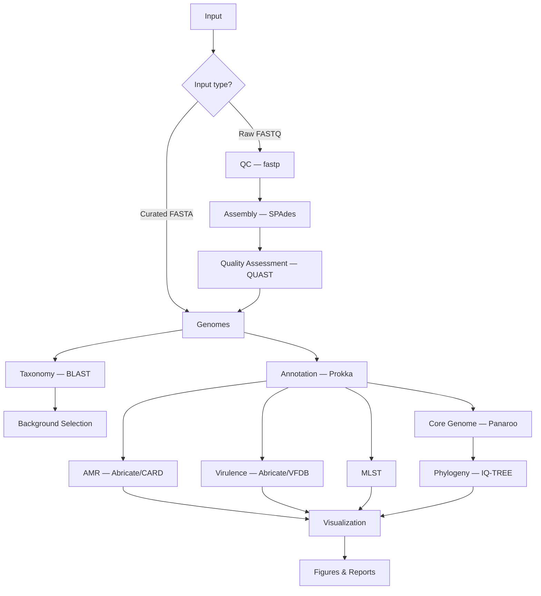

# GBS-Genomics-Pipeline

[](https://www.nextflow.io/)
[](https://hub.docker.com/r/kizitodevbio/strepto-pipeline)
[](LICENSE)

An open-source, reproducible Nextflow DSL2 workflow for whole-genome analysis of **Streptococcus agalactiae** (Group B Streptococcus, GBS).

## Overview

GBS-Genomics-Pipeline automates bacterial genomics from raw sequencing reads or pre-assembled genomes through annotation, antimicrobial resistance (AMR) detection, virulence profiling, MLST typing, core genome phylogeny, and publication-quality visualization.

Designed for researchers, clinicians, and bioinformaticians worldwide — runs on laptops, workstations, HPC clusters, and cloud environments via Docker, Singularity, or Conda.

### Scientific Background

Group B Streptococcus is a leading cause of neonatal sepsis and meningitis. Whole-genome sequencing enables surveillance of AMR, virulence factors, and clonal spread. This pipeline integrates established open-source tools (Prokka, Abricate, MLST, Panaroo, IQ-TREE) into a single reproducible workflow.

## Workflow



> **Note:** Human genome decontamination was removed from the active workflow. Frozen modules are preserved in `modules/frozen/` for reference.

## Quick Start

### Prerequisites

- [Nextflow](https://www.nextflow.io/) ≥ 22.10
- One of: [Docker](https://docs.docker.com/get-docker/), [Singularity/Apptainer](https://apptainer.org/), or [Conda/Mamba](https://docs.conda.io/)

### Installation

```bash
git clone https://github.com/kizito-devbio/GBS-Genomics-Pipeline.git
cd GBS-Genomics-Pipeline
```

Pull the container (optional — Nextflow pulls automatically):

```bash
docker pull kizitodevbio/strepto-pipeline:latest
```

### Run with curated genomes

```bash
nextflow run pipeline.nf \
  -profile docker \
  --curated_dir /path/to/fastas \
  --outdir results
```

### Run with raw reads

```bash
nextflow run pipeline.nf \
  -profile docker \
  --raw_dir /path/to/fastq \
  --outdir results
```

### Resume an interrupted run

```bash
nextflow run pipeline.nf -profile docker --curated_dir data/ --outdir results -resume
```

## Input Formats
GBS-Genomics-Pipeline supports both pre-assembled genomes and raw paired-end sequencing reads.

| Pathway | Format                          | Supported naming conventions                   |
| ------- | ------------------------------- | ---------------------------------------------- |
| Curated | FASTA (`.fa`, `.fna`, `.fasta`) | Any valid FASTA basename, e.g. `sample1.fasta` |
| Raw     | Paired-end FASTQ                | Supports multiple Illumina naming formats:     |
|         |                                 | `sample_1.fastq` + `sample_2.fastq`            |
|         |                                 | `sample_1.fastq.gz` + `sample_2.fastq.gz`      |
|         |                                 | `sample_R1.fastq` + `sample_R2.fastq`          |
|         |                                 | `sample_R1.fastq.gz` + `sample_R2.fastq.gz`    |
|         |                                 | `sample_1.fq` + `sample_2.fq`                  |
|         |                                 | `sample_1.fq.gz` + `sample_2.fq.gz`            |
|         |                                 | `sample_R1.fq` + `sample_R2.fq`                |
|         |                                 | `sample_R1.fq.gz` + `sample_R2.fq.gz`          |

The raw-read pathway automatically detects supported paired-end FASTQ naming conventions and performs quality control, genome assembly, and downstream whole-genome analysis.


## Output Structure

```
results/
├── QC/                  # Trimmed reads, FastQC reports (raw pathway)
├── Assembly/            # Assembled contigs, QUAST reports
├── Annotation/          # Prokka outputs per sample
├── AMR/                 # Abricate CARD results (*_amr.tsv)
├── Virulence/           # Abricate VFDB results (*_vf.tsv)
├── MLST/                # MLST assignments (*_mlst.tsv)
├── CoreGenome/          # Panaroo pangenome results
├── Phylogeny/           # IQ-TREE Newick tree (gbs_phylogeny_tree.nwk)
├── Figures/             # Publication figures (PNG, SVG, PDF)
├── Reports/             # Summary reports, skip explanations
└── Logs/                # Per-process logs, timeline, DAG, trace
```

## Visualization

The final workflow stage generates figures exclusively from validated pipeline outputs:

| Figure | Source data |
|--------|-------------|
| AMR heatmap | `AMR/*_amr.tsv` |
| Virulence heatmap | `Virulence/*_vf.tsv` |
| Combined AMR + Virulence heatmap | Both |
| AMR / Virulence frequency | Gene presence matrices |
| MLST distribution | `MLST/*_mlst.tsv` |
| Co-occurrence matrices | Gene presence matrices |
| Annotated phylogenetic trees | Tree + AMR/VF/MLST |
| Sample summary dashboard | All sources |

If required data are unavailable, a `Reports/<figure>_SKIPPED.txt` file explains why — no placeholder data is generated.

## Parameters

| Parameter | Default | Description |
|-----------|---------|-------------|
| `--curated_dir` | — | Path to assembled FASTA files |
| `--raw_dir` | — | Path to paired FASTQ files |
| `--outdir` | `./results` | Output directory |
| `--mlst_scheme` | `sagalactiae` | PubMLST scheme |
| `--min_n50` | `10000` | Minimum N50 for assembly pass filter |
| `--max_cpus` | auto | Maximum CPU cores |
| `--max_memory` | `6 GB` | Maximum memory |
| `--help` | — | Print parameter reference |

See [docs/PARAMETERS.md](docs/PARAMETERS.md) for the complete parameter reference.

## Profiles

| Profile | Description |
|---------|-------------|
| `docker` | Docker container execution (recommended) |
| `singularity` | Singularity/Apptainer on HPC |
| `conda` | Local Conda environment per process |
| `cluster` | SLURM cluster submission |
| `test` | Reduced resources for testing |

## Software Requirements

| Tool | Version | Purpose |
|------|---------|---------|
| fastp | apt | Read trimming |
| SPAdes | 4.2.0 | Genome assembly |
| QUAST | pip | Assembly QC |
| Prokka | 1.14.6 | Gene annotation |
| Abricate | latest | AMR & virulence |
| MLST | 2.x | Sequence typing |
| Panaroo | 1.5.0 | Core genome |
| IQ-TREE | 2.x | Phylogeny |
| ete3 | 3.1.3 | Tree visualization |
| BLAST+ | 2.15 | Taxonomy |

Full list in [docker/Dockerfile](docker/Dockerfile).

## Troubleshooting

| Issue | Solution |
|-------|----------|
| `Provide --raw_dir or --curated_dir` | Specify exactly one input pathway |
| Core genome fails with 1 sample | Phylogeny requires ≥2 samples; pipeline skips gracefully |
| Docker permission denied | Add user to docker group or use `sudo` |
| Conda env build slow | First run downloads packages; subsequent runs use cache |
| Empty AMR/VF results | Check Abricate database setup: `abricate --setupdb` |
| Resume not working | Ensure same `--outdir` and work directory |

## Performance Tips

- Use `-profile docker` for fastest setup on workstations
- Set `--max_cpus` and `--max_memory` for your hardware
- Use `-resume` to avoid re-running completed steps
- Pre-assembled genomes (`--curated_dir`) skip QC/assembly and run faster
- HPC users: `-profile cluster` with `-profile singularity`

## Known Limitations

- Phylogenetic analysis requires sufficient numbers of genomes for reliable inference:
  - 1 genome: phylogenetic tree generation is skipped.
  - 2 genomes: phylogenetic tree generation is skipped.
  - 3 genomes: phylogenetic tree is generated, but bootstrap support values are not available.
  - ≥4 genomes: phylogenetic reconstruction is performed with bootstrap support.

- MLST clonal complex assignment depends on PubMLST scheme coverage.
- Raw-read pathway quality depends on sequencing depth, read quality, and genome completeness.
- Human decontamination is not performed in the active workflow (see `modules/frozen/`).

## Citation

If you use this pipeline, please cite:

```bibtex
@software{gbs_genomics_pipeline,
  author  = {Sylvester-Ali, Kizito Ibeojo},
  title   = {GBS-Genomics-Pipeline: Streptococcus agalactiae Whole-Genome Analysis},
  year    = {2026},
  url     = {https://github.com/kizito-devbio/GBS-Genomics-Pipeline}
}
```

See [CITATION.cff](CITATION.cff) for machine-readable citation metadata.

## License

MIT License — see [LICENSE](LICENSE).

## Contributing

Contributions are welcome. See [CONTRIBUTING.md](CONTRIBUTING.md) and [CODE_OF_CONDUCT.md](CODE_OF_CONDUCT.md).

## Changelog

See [CHANGELOG.md](CHANGELOG.md).

## Collaboration and Contact

GBS-Genomics-Pipeline is developed and maintained by **Kizito Ibeojo Sylvester-Ali** for reproducible whole-genome analysis of *Streptococcus agalactiae*.

The project welcomes collaborations, scientific discussions, testing, feature requests, and contributions from researchers, clinicians, and bioinformaticians interested in bacterial genomics, antimicrobial resistance surveillance, and pathogen genomics.

For collaboration inquiries, please contact:

**Kizito Ibeojo Sylvester-Ali**  

Email: [kizitosylvesterali@gmail.com](mailto:kizitosylvesterali@gmail.com)
GitHub: https://github.com/kizito-devbio

Contributions, suggestions, and improvements are welcome through GitHub issues and pull requests.
